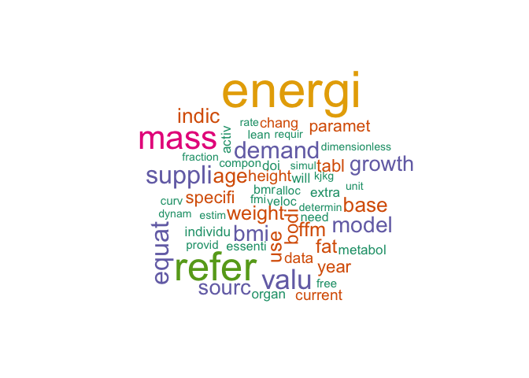
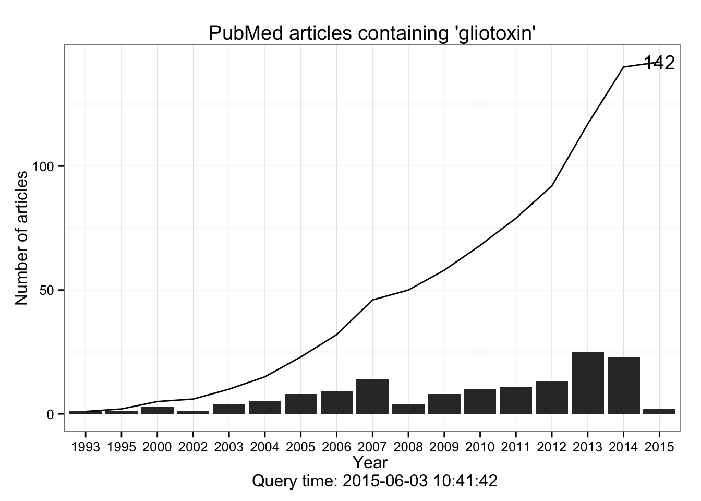
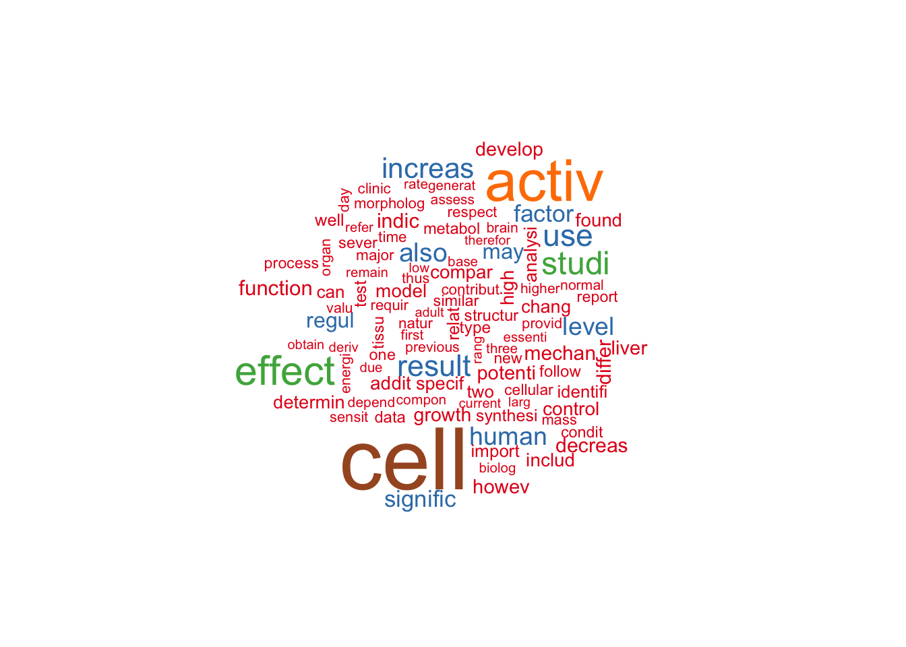

# Wordclouds
aaron gowins  
June 1, 2015  
## Hazir Model
We will make word clouds and maybe get some other text mining done. We start with a simple example of a text file of the Appendix of Hazhir Rahmandad's paper titled "Human Growth and Body Weight Dynamics: An Integrative Systems Model". This particular appendix is especially large, since this paper presents a mathematical model. 

We have a number of libraries to load, so make sure to install.packages() if these don't look familiar. If you want to see any of the manipulations that follow call inspect(docs[1]) before and after to see the difference. Most are at least vaguely self-explanatory.

Much of this is pulled from http://onepager.togaware.com/TextMiningO.pdf, which has many other terrific posts, and I highly recommend for clarity and for being thorough but brief.

http://amunategui.github.io/pubmed-query/ also has some great info, and is a quick read.


```r
library(SnowballC)
library(tm)
library(qdap)
library(ggplot2)
library(scales)
library(dplyr)
docs<-Corpus(DirSource("/Users/aarongowins/Desktop/txt_files"))
docs <- tm_map(docs, content_transformer(tolower))
docs <- tm_map(docs, removeNumbers)
docs <- tm_map(docs, removePunctuation)
docs <- tm_map(docs, removeWords, stopwords("english"))
docs <- tm_map(docs, stripWhitespace)
docs <- tm_map(docs, stemDocument)
dtm <- DocumentTermMatrix(docs)
#tdm <- TermDocumentMatrix(docs)
freq <- colSums(as.matrix(dtm))
dtm <- removeSparseTerms(dtm, 0.5)
findFreqTerms(dtm, lowfreq=5)
```

```
##  [1] "activ"         "adjust"        "age"           "alloc"        
##  [5] "balanc"        "base"          "bmi"           "bmr"          
##  [9] "bodi"          "cdc"           "chang"         "compon"       
## [13] "creat"         "current"       "curv"          "data"         
## [17] "demand"        "densiti"       "determin"      "differ"       
## [21] "dimensionless" "discuss"       "doi"           "dynam"        
## [25] "energi"        "equat"         "equilibrium"   "essenti"      
## [29] "estim"         "expenditur"    "extra"         "fat"          
## [33] "ffm"           "fmi"           "fraction"      "free"         
## [37] "growth"        "height"        "indic"         "individu"     
## [41] "kjkg"          "lean"          "linear"        "mass"         
## [45] "metabol"       "model"         "need"          "normal"       
## [49] "nutrit"        "organ"         "paramet"       "process"      
## [53] "provid"        "rate"          "refer"         "report"       
## [57] "requir"        "simul"         "sourc"         "specifi"      
## [61] "suppli"        "tabl"          "term"          "two"          
## [65] "unit"          "use"           "valu"          "variat"       
## [69] "veloc"         "weight"        "will"          "year"
```

```r
findAssocs(dtm, "data", corlimit=0.1)
```

```
## $data
## numeric(0)
```

```r
freq <- sort(colSums(as.matrix(dtm)), decreasing=TRUE)
library(wordcloud)
set.seed(123)
wordcloud(names(freq),freq,min.freq=6, colors=brewer.pal(6,"Dark2"))
```

 

## PubMed Gliotoxin Search

Gliotoxin in a powerful poison produced by many strains of infectious fungi. It works by inhibiting the binding of the transcription factor NFkB, which is a key factor in human immune response.

We would like to collect all articles in PubMed that refer to gliotoxin, which, according to the obscurity of our keyword and our recollection that it was discovered in 1993, we can assume will be a fairly small collection.

RISmed is by far the most complete package for text mining in R, but there are some really cool functions in others like pubmed.mineR. These are extremely small-scale examples of what text mining can be, and real queries can take enormous space, so be ready if you want to search "cancer" to add some severe restrictions.

We will examine the titles and abstracts.


```r
library(RISmed)
p<-"gliotoxin"
res <- EUtilsSummary(p, type="esearch", db="pubmed")
date()
```

```
## [1] "Wed Jun  3 11:14:06 2015"
```

```r
fetch <- EUtilsGet(res,type="efetch", db="pubmed")
count<-table(YearReceived(fetch))
count<-as.data.frame(count)
articles<-data.frame('Title'=ArticleTitle(fetch),'Abstract'=AbstractText(fetch))
head(articles,1)
```

```
##                                                                                                           Title
## 1 Proteomic analyses reveal the key roles of BrlA and AbaA in biogenesis of gliotoxin in Aspergillus fumigatus.
##                                                                                                                                                                                                                                                                                                                                                                                                                                                                                                                                                                                                                                                                                                                                                                                                                                                                                                                                                                                                                                                                                                                                                                                                                                                                                                                                                                                                                                                                                                                                                                                      Abstract
## 1 The opportunistic human pathogenic fungus Aspergillus fumigatus primarily reproduces by forming a large number of asexual spores (conidia). Sequential activation of the central regulators BrlA, AbaA and WetA is necessary for the fungus to undergo asexual development. In this study, to address the presumed roles of these key developmental regulators during proliferation of the fungus, we analyzed and compared the proteomes of vegetative cells of wild type (WT) and individual mutant strains. Approximately 1300 protein spots were detectable from 2-D electrophoresis gels. Among these, 13 proteins exhibiting significantly altered accumulation levels were further identified by ESI-MS/MS. Markedly, we found that the GliM and GliT proteins associated with gliotoxin (GT) biosynthesis and self-protection of the fungus from GT were significantly down-regulated in the ΔabaA and ΔbrlA mutants. Moreover, mRNA levels of other GT biosynthetic genes including gliM, gliP, gliT, and gliZ were significantly reduced in both mutant strains, and no and low levels of GT were detectable in the ΔbrlA and ΔabaA mutant strains, respectively. As GliT is required for the protection of the fungus from GT, growth of the ΔbrlA mutant with reduced levels of GliT was severely impaired by exogenous GT. Our studies demonstrate that AbaA and BrlA positively regulate expression of the GT biosynthetic gene cluster in actively growing vegetative cells, and likely bridge morphological and chemical development during the life-cycle of A. fumigatus.
```

```r
write.table(articles,"/Users/aarongowins/Desktop/txt_files/AF.txt")
names(count)<-c("Year","Counts")
ccount <- data.frame(Year=count$Year, Counts=cumsum(count$Counts)) 
ccount$g <- "g"
names(ccount) <- c("Year","Counts","g")
q <- qplot(x=Year, y=Counts, data=count, geom="bar", stat="identity")
q <- q + geom_line(aes(x=Year, y=Counts, group=g), data=ccount) +
    ggtitle(paste("PubMed articles containing \'",p,"\'", sep="")) +
    ylab("Number of articles") +
    xlab(paste("Year \n Query time: ",Sys.time(), sep="")) +
    labs(colour="") +
    theme_bw()
q + theme(legend.position=c(0.2,0.85)) +
    annotate("text", x=max(as.numeric(ccount$Year)), y=max(ccount$Counts), label=max(ccount$Counts))
```

 

We can make a new word cloud for this search, we have added a large amount of text so we need to refresh docs. We follow the same general strategy as the first time, with parameters appropriate for a larger file. 


```r
docs<-Corpus(DirSource("/Users/aarongowins/Desktop/txt_files"))
docs <- tm_map(docs, content_transformer(tolower))
docs <- tm_map(docs, removeNumbers)
docs <- tm_map(docs, removePunctuation)
docs <- tm_map(docs, removeWords, stopwords("english"))
docs <- tm_map(docs, stripWhitespace)
docs <- tm_map(docs, stemDocument)
dtm <- DocumentTermMatrix(docs)
tdm <- TermDocumentMatrix(docs)
freq <- colSums(as.matrix(dtm))
dtm <- removeSparseTerms(dtm, .1)
t(findAssocs(dtm, "age", corlimit=0.5))
```

```
##     across alloc american bodi children clin cost creat curv demand deviat
## age      1     1        1    1        1    1    1     1    1      1      1
##     dynam energi equat equilibrium estim extra formul heart keep life mass
## age     1      1     1           1     1     1      1     1    1    1    1
##     match move note nutrit paramet refer satisfi slope sourc specifi sum
## age     1    1    1      1       1     1       1     1     1       1   1
##     suppli tabl variat veloc weight year
## age      1    1      1     1      1    1
```

```r
findFreqTerms(dtm, lowfreq=100)
```

```
##  [1] "activ"    "addit"    "also"     "analysi"  "can"      "cell"    
##  [7] "chang"    "compar"   "control"  "decreas"  "determin" "develop" 
## [13] "differ"   "effect"   "factor"   "found"    "function" "growth"  
## [19] "high"     "howev"    "human"    "identifi" "import"   "includ"  
## [25] "increas"  "indic"    "level"    "liver"    "may"      "mechan"  
## [31] "model"    "potenti"  "regul"    "relat"    "result"   "signific"
## [37] "specif"   "studi"    "two"      "use"      "well"
```

```r
freq <- sort(colSums(as.matrix(dtm)), decreasing=TRUE)
set.seed(123)
wordcloud(names(freq),freq,min.freq=40, colors=brewer.pal(7,"Set1"))
```

 
