# Wordclouds2
aaron gowins  
June 1, 2015  
## Hazir Model
Work done as part of the My-Classes Live Mentoring Program.
Check it out at: http://live.my-classes.com/ 
We will make word clouds and maybe get some other text mining done. We start with a simple example of a text file of the Appendix of Hazhir Rahmandad's paper titled "Human Growth and Body Weight Dynamics: An Integrative Systems Model". This particular appendix is especially large, since this paper presents a mathematical model. 

We have a number of libraries to load, so make sure to install.packages() if these don't look familiar. If you want to see any of the manipulations that follow call inspect(docs[1]) before and after to see the difference. Most are at least vaguely self-explanatory.

Much of this is pulled from http://onepager.togaware.com/TextMiningO.pdf, which has many other terrific posts, and I highly recommend for clarity and for being thorough but brief.

http://amunategui.github.io/pubmed-query/ also has some great info, and is a quick read.


```r
library(SnowballC)
library(tm)
library(qdap)
library(ggplot2)
library(scales)
library(dplyr)
docs<-Corpus(DirSource("/Users/aarongowins/Desktop/txt_files"))
docs <- tm_map(docs, content_transformer(tolower))
docs <- tm_map(docs, removeNumbers)
docs <- tm_map(docs, removePunctuation) # don't usually do this
docs <- tm_map(docs, removeWords, stopwords("english"))
docs <- tm_map(docs, stripWhitespace)
docs <- tm_map(docs, stemDocument) #u
dtm <- DocumentTermMatrix(docs)
#tdm <- TermDocumentMatrix(docs)
freq <- colSums(as.matrix(dtm))
dtm <- removeSparseTerms(dtm, 0.5)
findFreqTerms(dtm, lowfreq=5)
```

```
##   [1] "accord"       "account"      "achiev"       "activ"       
##   [5] "actual"       "adapt"        "addit"        "adult"       
##   [9] "age"          "alloc"        "allow"        "along"       
##  [13] "also"         "american"     "amount"       "analysi"     
##  [17] "appli"        "approach"     "approxim"     "around"      
##  [21] "assess"       "assign"       "assum"        "attempt"     
##  [25] "automat"      "avail"        "averag"       "avoid"       
##  [29] "balanc"       "basal"        "base"         "basic"       
##  [33] "becom"        "biol"         "biolog"       "bodi"        
##  [37] "brain"        "calibr"       "can"          "cell"        
##  [41] "cellular"     "center"       "chang"        "children"    
##  [45] "clinic"       "column"       "come"         "common"      
##  [49] "compar"       "comparison"   "complet"      "complic"     
##  [53] "compon"       "composit"     "concept"      "condit"      
##  [57] "conduct"      "consist"      "consum"       "continu"     
##  [61] "contribut"    "control"      "correct"      "correspond"  
##  [65] "count"        "cover"        "creat"        "current"     
##  [69] "curv"         "daili"        "data"         "day"         
##  [73] "decreas"      "definit"      "demand"       "densiti"     
##  [77] "depend"       "deriv"        "desir"        "detail"      
##  [81] "determin"     "develop"      "deviat"       "diabet"      
##  [85] "differ"       "discuss"      "distinct"     "divid"       
##  [89] "document"     "doubl"        "drive"        "due"         
##  [93] "effect"       "employ"       "enabl"        "endocrin"    
##  [97] "endogen"      "energi"       "equat"        "equilibrium" 
## [101] "essenti"      "estim"        "exampl"       "exclud"      
## [105] "exogen"       "experiment"   "explain"      "extent"      
## [109] "extra"        "fact"         "factor"       "fall"        
## [113] "feasibl"      "feed"         "final"        "first"       
## [117] "fit"          "five"         "focus"        "follow"      
## [121] "found"        "four"         "fraction"     "free"        
## [125] "full"         "function"     "gain"         "gap"         
## [129] "general"      "generat"      "given"        "growth"      
## [133] "health"       "help"         "high"         "higher"      
## [137] "howev"        "human"        "idea"         "identifi"    
## [141] "imbal"        "impact"       "import"       "includ"      
## [145] "increas"      "independ"     "indic"        "individu"    
## [149] "inform"       "insensit"     "key"          "kidney"      
## [153] "larg"         "last"         "latter"       "length"      
## [157] "let"          "level"        "linear"       "literatur"   
## [161] "liver"        "long"         "low"          "main"        
## [165] "mainten"      "major"        "marker"       "mass"        
## [169] "match"        "maximum"      "may"          "mean"        
## [173] "mechan"       "mechanist"    "metabol"      "minim"       
## [177] "minimum"      "model"        "moder"        "morpholog"   
## [181] "move"         "much"         "muscl"        "natur"       
## [185] "need"         "negat"        "new"          "next"        
## [189] "normal"       "note"         "nutrit"       "obtain"      
## [193] "one"          "open"         "organ"        "output"      
## [197] "overal"       "paper"        "paramet"      "per"         
## [201] "physic"       "physiol"      "point"        "potenti"     
## [205] "predict"      "prefer"       "pressur"      "previous"    
## [209] "process"      "project"      "provid"       "public"      
## [213] "purpos"       "quantifi"     "quantiti"     "rang"        
## [217] "rate"         "rather"       "ratio"        "reach"       
## [221] "reaction"     "recov"        "refer"        "reflect"     
## [225] "regress"      "regul"        "relat"        "relationship"
## [229] "relev"        "remain"       "remov"        "report"      
## [233] "repres"       "requir"       "research"     "residu"      
## [237] "respect"      "rest"         "result"       "review"      
## [241] "satisfi"      "second"       "seen"         "sensit"      
## [245] "seri"         "set"          "sever"        "shift"       
## [249] "short"        "signific"     "similar"      "simpl"       
## [253] "simul"        "singl"        "size"         "slope"       
## [257] "slow"         "small"        "sourc"        "specif"      
## [261] "specifi"      "start"        "state"        "stay"        
## [265] "strong"       "structur"     "studi"        "summar"      
## [269] "suppli"       "support"      "synthesi"     "tabl"        
## [273] "take"         "taken"        "techniqu"     "term"        
## [277] "test"         "therefor"     "three"        "throughout"  
## [281] "thus"         "time"         "tissu"        "togeth"      
## [285] "total"        "toward"       "turnov"       "two"         
## [289] "type"         "understand"   "unit"         "use"         
## [293] "valu"         "variabl"      "variat"       "veloc"       
## [297] "view"         "weight"       "well"         "whose"       
## [301] "will"         "without"      "year"         "yet"
```

```r
findAssocs(dtm, "fat", corlimit=0.1)
```

```
## $fat
## numeric(0)
```

```r
freq <- sort(colSums(as.matrix(dtm)), decreasing=TRUE)
library(wordcloud)
set.seed(223)
wordcloud(names(freq),freq,min.freq=6,max.words=70, colors=brewer.pal(6,"Dark2"))
```

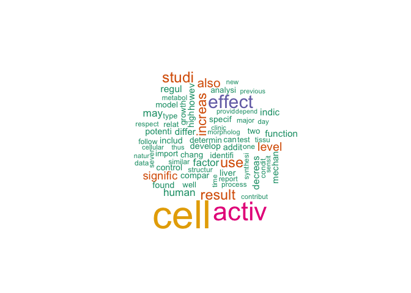 

## PubMed Gliotoxin Search

Gliotoxin in a powerful poison produced by many strains of infectious fungi. It works by inhibiting the binding of the transcription factor NFkB, which is a key factor in human immune response.

We would like to collect all articles in PubMed that refer to gliotoxin, which, according to the obscurity of our keyword and our recollection that it was discovered in 1993, we can assume will be a fairly small collection.

RISmed is by far the most complete package for text mining in R, but there are some really cool functions in others like pubmed.mineR. These are extremely small-scale examples of what text mining can be, and real queries can take enormous space, so be ready if you want to search "cancer" to add some severe restrictions.

We will examine the titles and abstracts.


```r
library(RISmed)
```

```
## Warning: package 'RISmed' was built under R version 3.1.3
```

```r
library(plyr)
```

```
## Warning: package 'plyr' was built under R version 3.1.3
```

```r
p<-"gliotoxin"
res <- EUtilsSummary(p, type="esearch", db="pubmed")
date()
```

```
## [1] "Sun Jun 14 12:57:05 2015"
```

```r
fetch <- EUtilsGet(res,type="efetch", db="pubmed")
```

```
## Warning in Medline(Result, query): NAs introduced by coercion
```

```
## Warning in Medline(Result, query): NAs introduced by coercion
```

```r
count<-table(YearReceived(fetch))
count<-as.data.frame(count)
articles<-data.frame('Title'=ArticleTitle(fetch),'Abstract'=AbstractText(fetch),'Year'=YearReceived(fetch))
#head(articles,1)
abstracts<-as.character(articles$Abstract)
#head(abstracts)
#set.seed(223)
#articlesX<-split(articles,as.factor("Year"))
#head(articles$Year,1)
#dim(articles)
wordcloud(abstracts,min.freq=10,max.words=70, colors=brewer.pal(7,"Set1"))
```

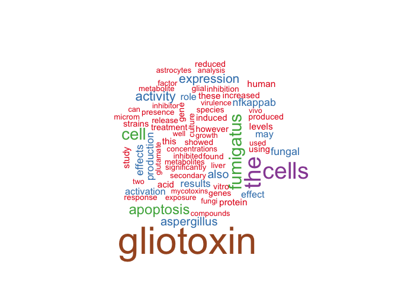 

```r
articlesC<-aggregate(x=articles,by=list(articles$Year),FUN = function(X) paste(unique(X), collapse=", "))


  simplefunc <- function(articlesC) {
          print(articlesC$Year)
       articlesC$Abstract<-as.character(articlesC$Abstract)
       freqList<-table(articlesC$Abstract)
freqList<-sort(freqList,decreasing=TRUE)
head(freqList)
 wordcloud(articlesC$Abstract,min.freq=1,max.words=30, colors=brewer.pal(7,"Set1"))
}


articles$Abstract<-as.character(articles$Abstract)
articles$Title<-as.character(articles$Abstract)
d_ply(articlesC,.(Year),  .fun=simplefunc) 
```

```
## [1] "1993"
```

```
## Warning in wordcloud(articlesC$Abstract, min.freq = 1, max.words = 30,
## colors = brewer.pal(7, : gliotoxin could not be fit on page. It will not
## be plotted.
```

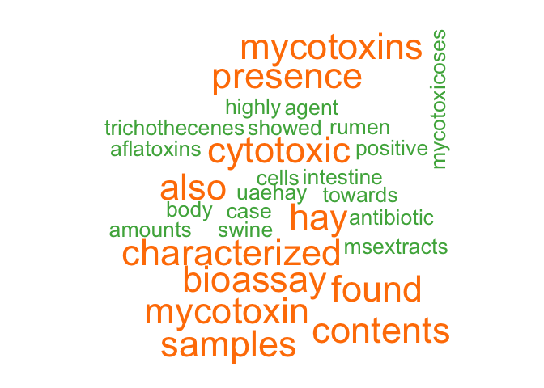 

```
## [1] "1995"
```

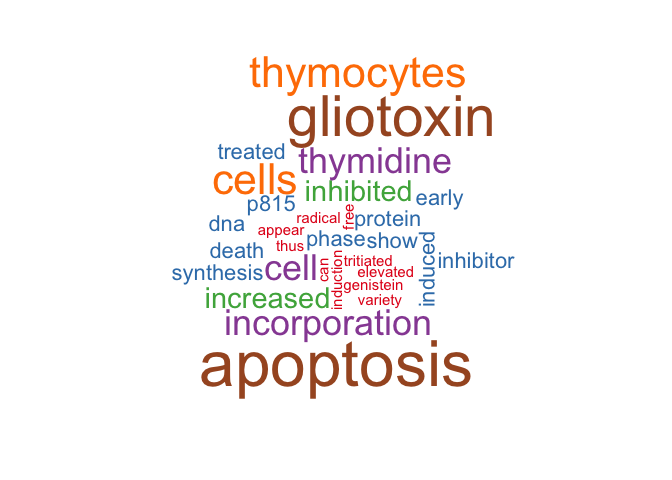 

```
## [1] "2000"
```

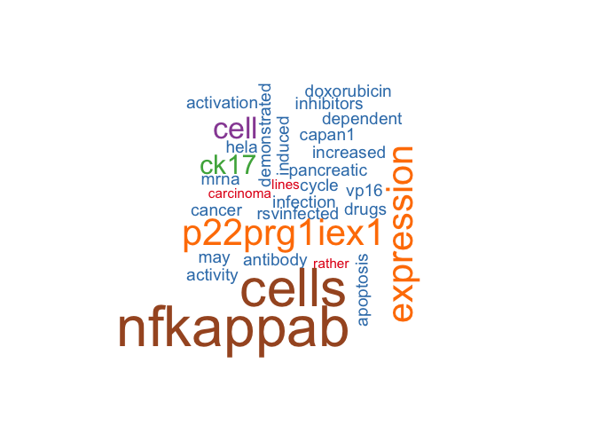 

```
## [1] "2002"
```

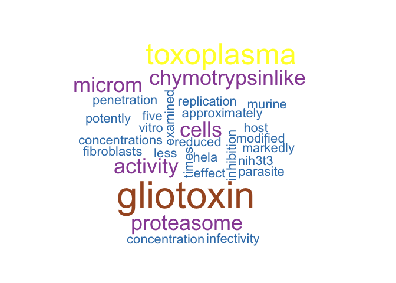 

```
## [1] "2003"
```

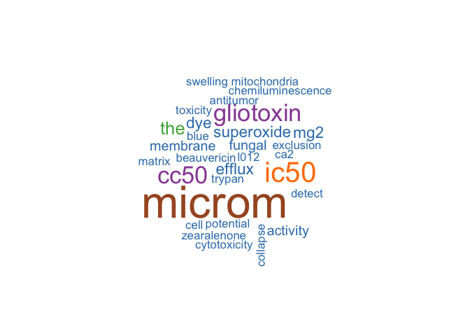 

```
## [1] "2004"
```

```
## Warning in wordcloud(articlesC$Abstract, min.freq = 1, max.words = 30,
## colors = brewer.pal(7, : production could not be fit on page. It will not
## be plotted.
```

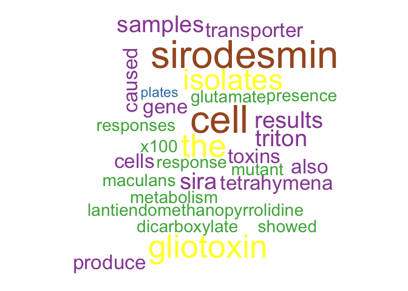 

```
## [1] "2005"
```

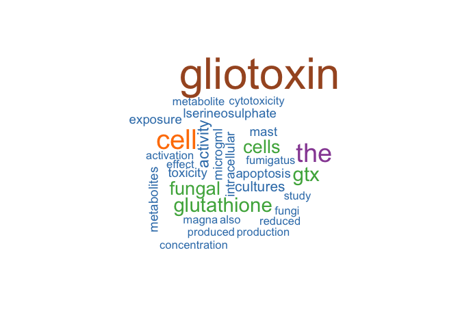 

```
## [1] "2006"
```

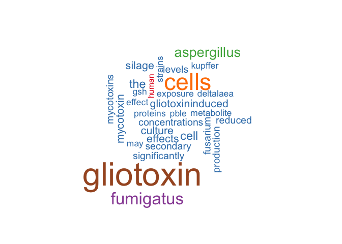 

```
## [1] "2007"
```

```
## Warning in wordcloud(articlesC$Abstract, min.freq = 1, max.words = 30,
## colors = brewer.pal(7, : gliotoxin could not be fit on page. It will not
## be plotted.
```

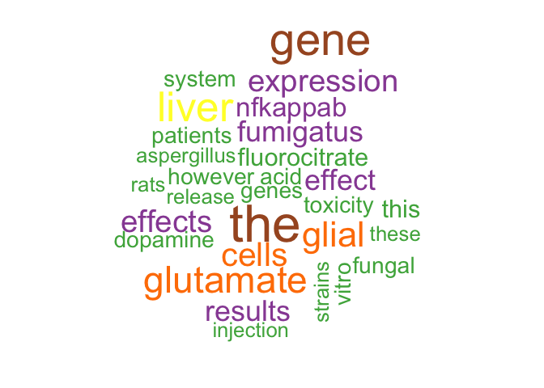 

```
## [1] "2008"
```

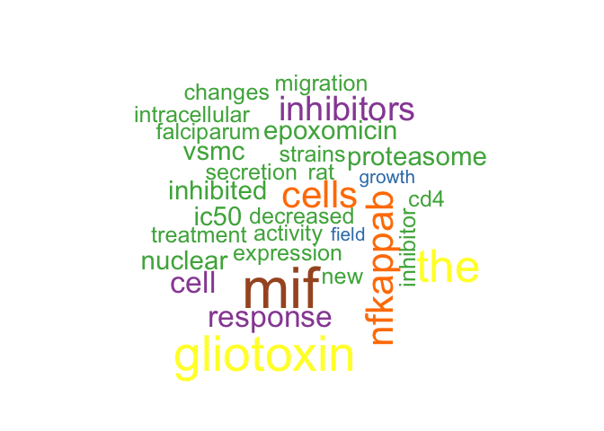 

```
## [1] "2009"
```

 

```
## [1] "2010"
```

```
## Warning in wordcloud(articlesC$Abstract, min.freq = 1, max.words = 30,
## colors = brewer.pal(7, : fumigatus could not be fit on page. It will not
## be plotted.
```

 

```
## [1] "2011"
```

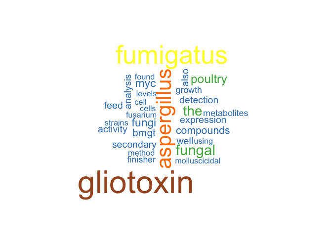 

```
## [1] "2012"
```

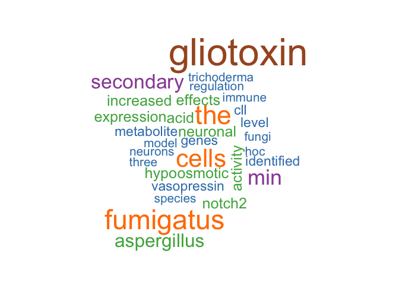 

```
## [1] "2013"
```

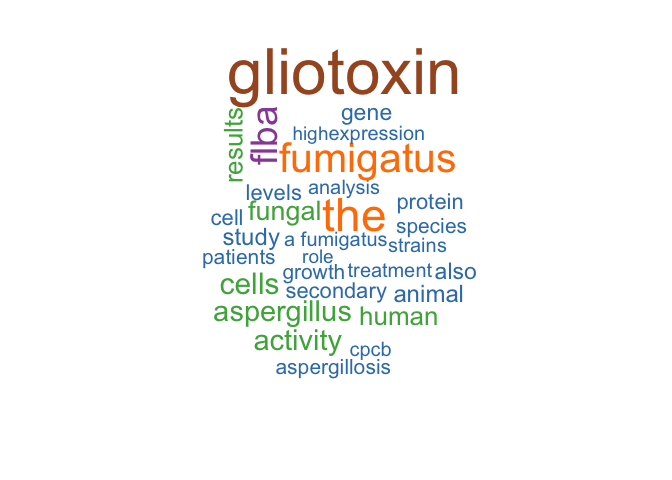 

```
## [1] "2014"
```

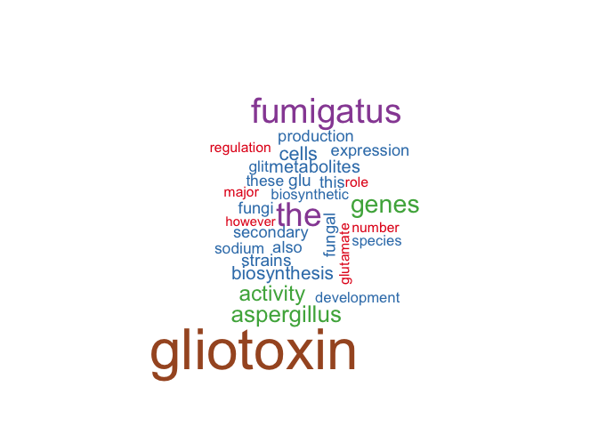 

```
## [1] "2015"
```

```
## Warning in wordcloud(articlesC$Abstract, min.freq = 1, max.words = 30,
## colors = brewer.pal(7, : levels could not be fit on page. It will not be
## plotted.
```

```
## Warning in wordcloud(articlesC$Abstract, min.freq = 1, max.words = 30,
## colors = brewer.pal(7, : mutant could not be fit on page. It will not be
## plotted.
```

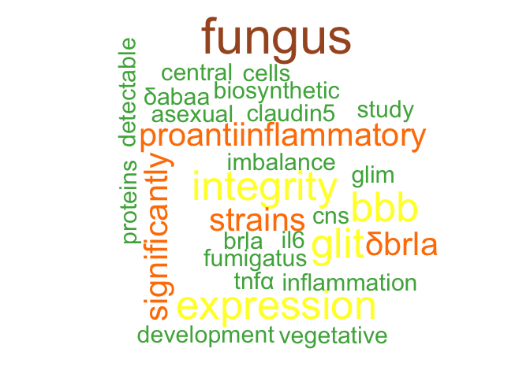 

```r
        abstractsY<-articles[which(articles$Year==2015),]
dim(abstractsY)
```

```
## [1] 2 3
```

```r
       abstractsY<-as.character(abstractsY$Abstract)
#abstractsY
set.seed(223)
wordcloud(abstractsY,min.freq=1,max.words=30, colors=brewer.pal(7,"Set1"))
```

```
## Warning in wordcloud(abstractsY, min.freq = 1, max.words = 30, colors =
## brewer.pal(7, : fungus could not be fit on page. It will not be plotted.
```

```
## Warning in wordcloud(abstractsY, min.freq = 1, max.words = 30, colors =
## brewer.pal(7, : regulators could not be fit on page. It will not be
## plotted.
```

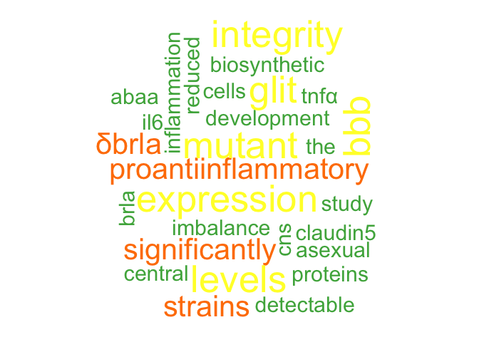 

```r
head(count,1)
```

```
##   Var1 Freq
## 1 1993    1
```

```r
write.table(articles,"/Users/aarongowins/Desktop/txt_files/AF.txt")
names(count)<-c("Year","Counts")
ccount <- data.frame(Year=count$Year, Counts=cumsum(count$Counts)) 
ccount$g <- "g"
names(ccount) <- c("Year","Counts","g")
head(ccount)
```

```
##   Year Counts g
## 1 1993      1 g
## 2 1995      2 g
## 3 2000      5 g
## 4 2002      6 g
## 5 2003     10 g
## 6 2004     15 g
```

```r
q <- qplot(x=Year, y=Counts, data=count, geom="bar", stat="identity")
q <- q + geom_line(aes(x=Year, y=Counts, group=g), data=ccount) +
    ggtitle(paste("PubMed articles containing \'",p,"\'", sep="")) +
    ylab("Number of articles") +
    xlab(paste("Year \n Query time: ",Sys.time(), sep="")) +
    labs(colour="") +
    theme_bw()
q + theme(legend.position=c(0.2,0.85)) +
    annotate("text", x=max(as.numeric(ccount$Year)), y=max(ccount$Counts), label=max(ccount$Counts))
```

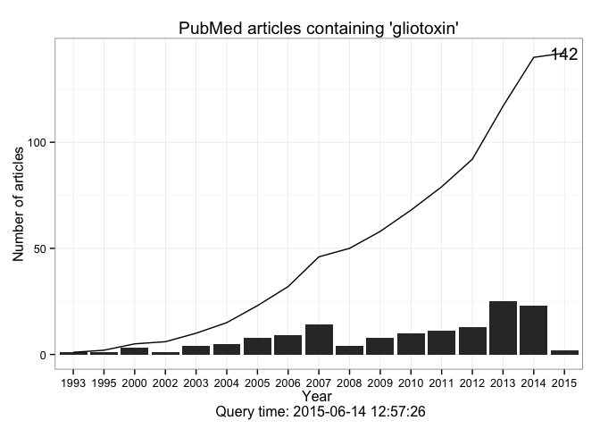 


```r
text<-as.character(articles)
#text<-unlist(text)
#textFREQ<-table(text)
#textFREQ<-sort(textFREQ,decreasing=TRUE)
library(stringi)
```

```
## Warning: package 'stringi' was built under R version 3.1.2
```

```r
text1<-stri_count(text,regex="\\S+")
#text1<-sapply(strsplit(text, " "), length)
head(text1)
```

```
## [1] 101372 101372    583
```

```r
#head(text)
```
We can make a new word cloud for this search, we have added a large amount of text so we need to refresh docs. We follow the same general strategy as the first time, with parameters appropriate for a larger file. 

```
docs<-Corpus(DirSource("/Users/aarongowins/Desktop/txt_files"))
docs <- tm_map(docs, content_transformer(tolower))
docs <- tm_map(docs, removeNumbers)
docs <- tm_map(docs, removePunctuation)
docs <- tm_map(docs, removeWords, stopwords("english"))
docs <- tm_map(docs, stripWhitespace)
docs <- tm_map(docs, stemDocument)
dtm <- DocumentTermMatrix(docs)
freq <- colSums(as.matrix(dtm))
dtm <- removeSparseTerms(dtm, .1)
t(findAssocs(dtm, "age", corlimit=0.5))
findFreqTerms(dtm, lowfreq=100)
freq <- sort(colSums(as.matrix(dtm)), decreasing=TRUE)
set.seed(123)
wordcloud(names(freq),freq,min.freq=40, colors=brewer.pal(7,"Set1"))
```
