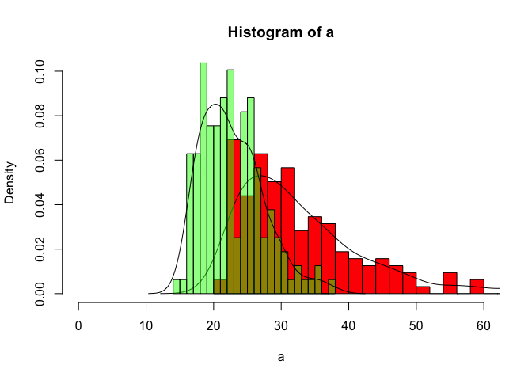
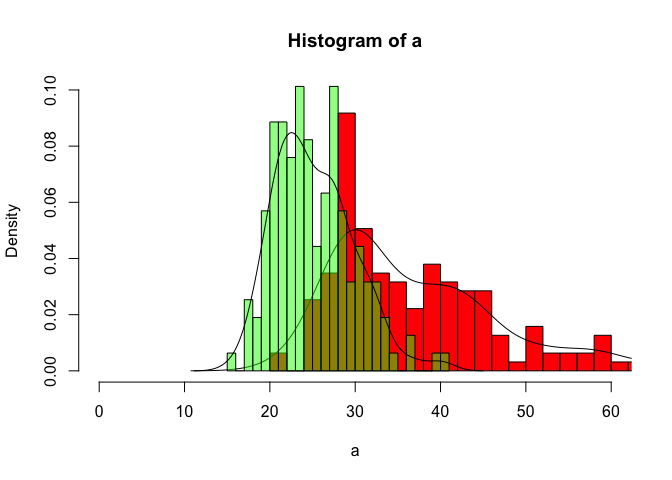

# NHANES_1
aaron gowins  
May 22, 2015  


This project is continually updated at: http://rpubs.com/aarongowins/83733
## Goal

We have two models of childhood growth. They are trained to predict body composition (fat mass/lean mass distribution), throughout growth. They are also capable of determining the energy intake and expenditure related to a certain gain or loss in fat mass and lean mass. The goal of the models is twofold:

* To predict the body composition of a child given a certain energy intake. It requires more energy to deposit fat mass than lean mass.

* To predict the energy that must have been absorbed in order to reach a certain body composition. Lean mass has a considerably higher metabolic rate than fat mass, so a leaner child will need to consume more energy to maintain his/her weight and grow.

* We are particularly interested in the first two years of growth, and optimistically we would like information from birth to six months.

There is some brevity in the preceeding discussion, for instance we can initiate a birthweight, change caloric intake over time, etc. I don't think I've left out any relevant model details, but correct me if I'm wrong.

## Now the Statistical Challenge

We have World Health Organization (WHO) data that includes weight for each age, and intake for each age. The weight data is divided by "standard deviations" from the "mean". If we cause the models to follow the 0SD ("mean") weight trajectory (which we can do), and compare the model outputs for energy intake to see which model is closest to the mean intake trajectory, to what degree can we conclude which model works best, and what strategies are necessary to make the best conclusion?

There are several reasons for the quotes around standard deviation and mean:
For anyone interested in some very disciplined and sophisticated dataset construction, visit http://www.who.int/childgrowth/standards/technical_report/en/ and begin with the introduction. This dataset is derived from a combination of longitudinal and cross-sectional data, for which there is a detailed protocol to apply weighting. The 0SD is a "mean" value, but it is derived from an age-transformation power based on examining changes in global deviance. This along with some technical details resulted in a smoothed and fitted model, which was subsequently subjected to a rigorous skewing adjustment method involving what's called a Box-Cox transform power. The result is a dataset with something that resembles a mean and values corresponding to something they call standard deviations, but that is nothing like any classically derived distribution, and is several layers removed from our intuition regarding binning and probability, means, and the rest.
Here is a sample of the weight data, all masses are in kilograms.


```r
URL4<-"http://www.who.int/childgrowth/standards/wfa_boys_0_5_zscores.txt"
download.file(URL4,destfile="WHOdat",method="curl")
whodat<-read.table("WHOdat", header=TRUE)
head(whodat)
```

```
##   Month      L      M       S SD3neg SD2neg SD1neg SD0 SD1 SD2  SD3
## 1     0 0.3487 3.3464 0.14602    2.1    2.5    2.9 3.3 3.9 4.4  5.0
## 2     1 0.2297 4.4709 0.13395    2.9    3.4    3.9 4.5 5.1 5.8  6.6
## 3     2 0.1970 5.5675 0.12385    3.8    4.3    4.9 5.6 6.3 7.1  8.0
## 4     3 0.1738 6.3762 0.11727    4.4    5.0    5.7 6.4 7.2 8.0  9.0
## 5     4 0.1553 7.0023 0.11316    4.9    5.6    6.2 7.0 7.8 8.7  9.7
## 6     5 0.1395 7.5105 0.11080    5.3    6.0    6.7 7.5 8.4 9.3 10.4
```


## Analysis

My hapless attempt to understand this procedure follows.

We can't find reliable data for both body composition and energy intake that is subject specific, and has the power we will need for young ages. One reason is that reliable methods for estimating fat and lean mass in an individual involve X-rays, and are almost never applied to children under eight for fear of harm from the X-rays. Let's find out if in general, the 50th percentile or mean for weight can be used to predict the median or mean lean body mass of a child. The reason this might be helpful is because energy expenditure is governed primarily by body composition, since lean mass requires more energy to maintain than fat mass. If we wish to make a prediction of energy expenditure based on weight, then we must be able to predict lean mass, or equvalently, body composition, based on weight.

The CDC NHANES study has collected very good data for subjecs ages 8 and over, including fat and lean mass values. We will load some of that data and choose 8 year olds to control for age, because that's the lowest age we have subject-specific data for. We will ignore the gender to improve our power, because until puberty the growth trajectories are similar.


```r
# Visit the NHANES website: http://wwwn.cdc.gov/nchs/nhanes/search/nhanes_continuous.aspx
# and right click on the link to the data you want, copy and paste the URL here:
URL<-"ftp://ftp.cdc.gov/pub/Health_Statistics/NCHS/nhanes/dxx/dxx_c.xpt"
download.file(URL,destfile="CDC",method="curl") # <-- On a PC you want to delete "method="curl"
#install.packages('Hmisc') <- uncomment this if it doesn't look familiar
library(Hmisc) #<-- need to load package for SAS files .xpt
mydata <- sasxport.get("CDC")
```

```
## Processing SAS dataset DXX_C 	 ..
```

```r
#head(mydata) #<-- Uncomment this to see the first six lines of your file
#str(mydata) #<-- Uncomment this to see the structre of your file
#summary(mydata) #<-- Uncomment this to see a summary of your file
# Descriptions of the variables are at (example): http://www.cdc.gov/nchs/data/nhanes/dxa/dxx_c.pdf
means<-aggregate(.~seqn,FUN=mean,data=mydata) #<-- Each subject had five measurements, find the means
# Load the demographic data for variables like age, etc., matched by "seqn":
URL2<-"http://wwwn.cdc.gov/nchs/nhanes/2003-2004/DEMO_C.XPT"
download.file(URL2,destfile="CDC2",method="curl") #<-- No curl for PC
mydata2 <- sasxport.get("CDC2")
```

```
## Processing SAS dataset DEMO_C 	 ..
```

```r
# Descriptions of the variables are at (ex): http://wwwn.cdc.gov/nchs/nhanes/search/nhanes03_04.aspx
URL3<-"http://wwwn.cdc.gov/nchs/nhanes/2003-2004/BMX_C.XPT"
download.file(URL3,destfile="CDC3",method="curl")
mydata3 <- sasxport.get("CDC3")
```

```
## Processing SAS dataset BMX_C 	 ..
```

```r
#URL<-("ftp://ftp.cdc.gov/pub/Health_Statistics/NCHS/Program_Code/NHIS/2010/SC_BWT10.sas")
#download.file(URL,destfile="CDC4",method="curl")
#birth<-sasxport.get("CDC4")
library(plyr)
#install.packages('gdata')
library(gdata)
#library(e1071)
heights<-mydata3[,c(1,15)] #<-- choose the subject id and height
ages<-mydata2[,c(1,8,5,6)] #<-- choose the subject id, age in months, age in years, and gender
masses<-means[,c(1,105,104,102)] #<-- choose the subject id, bodyweight, fat mass, and lean mass
all_data<-merge(masses,ages,by="seqn") #<-- Merge the set by subject id
all_data<-merge(all_data,heights,by="seqn")
all_data$dxdtotot<-all_data$dxdtotot/1000 #<-- change from grams to kilograms
all_data$dxdtoli<-all_data$dxdtoli/1000
all_data$dxdtofat<-all_data$dxdtofat/1000
dims<-dim(all_data)
head(all_data)
```

```
##    seqn dxdtotot dxdtoli dxdtofat ridageex riagendr ridageyr bmxht
## 1 21007  48.5511 35.4878  13.0633      172        2       14 161.2
## 2 21008  69.9100 58.6980  11.2120      209        1       17 184.1
## 3 21009 105.0917 71.8855  33.2062      672        1       55 181.6
## 4 21010  68.3407 39.0149  29.3258      634        2       52 163.2
## 5 21013  55.2943 39.8449  15.4494      164        2       13 159.0
## 6 21016  51.3267 35.0957  16.2310      166        1       13 153.7
```

```r
male_data<-all_data[which(all_data$riagendr==1),] #<-- choose males
female_data<-all_data[which(all_data$riagendr==2),] #<-- choose females
#install.packages('xlsx') #<-- uncomment if this has never been done before
#library(xlsx) #<-- Open if you want to write files
#write.xlsx(male_data,file="./maleCDCdataMo.xlsx") #<-- where do you want the file?
#write.xlsx(female_data,file="./femaleCDCdataMo.xlsx") #<-- please specify a directory
```

```r
all_data8<-all_data[which(all_data$ridageyr<9),] #<-- choose 8 year olds
num<-nrow(all_data8)
```

Now we have a subset of data with 159 eight year old subjects. We would like to know if there is a correlation between weight and lean mass in order to determine if weight is a good predictor.


```r
library(plyr)
library(gdata)
#library(e1071)
all_data_cors<-as.matrix(all_data8)
cor(all_data_cors)
```

```
##                 seqn    dxdtotot     dxdtoli   dxdtofat     ridageex
## seqn      1.00000000  0.05257719  0.04143932 0.05635133 -0.100079461
## dxdtotot  0.05257719  1.00000000  0.93247217 0.96019785  0.161676148
## dxdtoli   0.04143932  0.93247217  1.00000000 0.79445544  0.179234742
## dxdtofat  0.05635133  0.96019785  0.79445544 1.00000000  0.133222601
## ridageex -0.10007946  0.16167615  0.17923474 0.13322260  1.000000000
## riagendr -0.09636961 -0.03595948 -0.18898447 0.08567191 -0.002542095
## ridageyr          NA          NA          NA         NA           NA
## bmxht             NA          NA          NA         NA           NA
##              riagendr ridageyr bmxht
## seqn     -0.096369609       NA    NA
## dxdtotot -0.035959482       NA    NA
## dxdtoli  -0.188984465       NA    NA
## dxdtofat  0.085671913       NA    NA
## ridageex -0.002542095       NA    NA
## riagendr  1.000000000       NA    NA
## ridageyr           NA        1    NA
## bmxht              NA       NA     1
```

There appears to be an extremely high correlation between weight and lean mass. Therefore, we can predict lean mass by knowing weight with a great degree of certainty. Additionally, we can predict with some certainty energy intake given a value for weight, because we have an idea of the body composition.

The crucial question, however, is; to what extent can we conclude that a subject with average bodyweight will have average lean mass?

We will calculate the means for each measurement, and then see if the subjects are the same. Let's first sort the dataset by weight so we know we are looking for around the 80th subject.


```r
weight <- all_data8[order(all_data8$dxdtotot),]
meanweight<-mean(weight$dxdtotot)
meanlean<-mean(weight$dxdtoli)
which(abs(all_data8$dxdtoli-meanlean)==min(abs(all_data8$dxdtoli-meanlean)))
```

```
## [1] 106
```

```r
which(abs(all_data8$dxdtotot-meanweight)==min(abs(all_data8$dxdtotot-meanweight)))
```

```
## [1] 93
```

We seem to be off by thirteen subjects. The subject closest to the mean weight is lighter than thirteen subjects who have less than average lean mass. Thirteen subjects who have less than average lean mass are heavier than the average weight subject.

It's fairly apparent why the weight subject is close to the 80th, and also why he is not the actual 80th. If the distributions were normal, then the 0SD would be equal to the 50th percentile (and in some other more peculiar situations). Since the WHO data are arranged by SD instead of quantiles, we might assume that the 0SD best describes the mean, but what if we were wrong, and the WHO 0SD is more like the 50th percentile, after all the diagnostics?

The median weight will have to be the 80th subject, right? Let's also see if by chance our medians are lining up, since we might wonder if the WHO data is better described as centered around the median value.


```r
#lean <- all_data[order(all_data$dxdtotot),]
which(weight$dxdtoli==median(weight$dxdtoli))
```

```
## [1] 51
```

```r
which(weight$dxdtotot==median(weight$dxdtotot))
```

```
## [1] 80
```

```r
head(weight)
```

```
##       seqn dxdtotot dxdtoli dxdtofat ridageex riagendr ridageyr bmxht
## 2975 25557  20.0909 14.8064   5.2845      104        2        8 123.4
## 512  21778  21.6614 15.6265   6.0349      102        2        8 118.5
## 1850 23824  22.1511 16.8503   5.3008      102        2        8 120.3
## 3849 26892  22.1591 17.2832   4.8759      101        2        8 125.7
## 1921 23940  22.2575 17.2591   4.9984      100        2        8 122.1
## 3366 26178  22.3755 17.3303   5.0452      101        2        8 122.5
```

The median weight the 80th subject, but the subject with the median lean mass is nowhere near the weight of the subject with the median weight. Even worse, unlike the comparison of means, where the child closest to the mean lean mass was heavier than the child closest to the mean weight, now the child with the median lean mass is much $\textit{lighter}$ than the child with the median weight.

Let's take a look at the distributions.


```r
#hist(all_data8$dxdtotot, breaks=40, main=("Histogram of weights"),freq=FALSE)
#lines(density(all_data8$dxdtotot))
#hist(all_data8$dxdtoli, breaks=40, main=("Histogram of lean masses"),freq=FALSE)
#lines(density(all_data8$dxdtoli))


a=all_data8$dxdtotot
b=all_data8$dxdtoli
p<-hist(a, xlim=c(0,60), ylim=c(0,.1), col="red",breaks=30,freq=FALSE)
lines(density(all_data8$dxdtotot))
hist(b, add=T, col=rgb(0, 1, 0, 0.5),breaks=30, freq=FALSE)
lines(density(all_data8$dxdtoli))
```

 

We can see that the distributions are not normal. We would have expected them to be somewhat skewed, simply because the values are bounded from below. What we also see is that they are not $\textit{similarly skewed}$. We can measure the degree to which a distribution is skewed in R...


```r
#skewness(all_data8$dxdtotot)
#skewness(all_data8$dxdtoli)
```

...and we can understand the meaning of these values, but are there solid tools to use these measurements to inform our model comparison?

Maybe we got unlucky with the 8 year olds, let's try 9 year olds.

```r
all_data9<-all_data[which(all_data$ridageyr<10 & all_data$ridageyr>8),]
#hist(all_data9$dxdtotot, breaks=40, main=("Histogram of weights"),freq=FALSE)

#lines(density(all_data9$dxdtotot))
#hist(all_data9$dxdtoli, breaks=40, main=("Histogram of lean masses"),freq=FALSE)

#lines(density(all_data9$dxdtoli))
a=all_data9$dxdtotot
b=all_data9$dxdtoli
p<-hist(a, xlim=c(0,60), ylim=c(0,.1),col="red",breaks=30,freq=FALSE)
lines(density(all_data9$dxdtotot))
hist(b, add=T, col=rgb(0, 1, 0, 0.5),breaks=30, freq=FALSE)
lines(density(all_data9$dxdtoli))
```

 

Again, of course the values are different, but the distributions are also different.

```r
#skewness(all_data9$dxdtotot)
#skewness(all_data9$dxdtoli)
sd(all_data9$dxdtotot)
```

```
## [1] 9.708309
```

```r
sd(all_data9$dxdtoli)
```

```
## [1] 4.588413
```

```r
quantile(all_data9$dxdtotot)
```

```
##       0%      25%      50%      75%     100% 
## 20.24430 29.54910 34.62705 42.61550 66.52730
```

```r
quantile(all_data9$dxdtoli)
```

```
##       0%      25%      50%      75%     100% 
## 15.60420 21.66630 24.59285 27.93962 40.51250
```

The 9 year olds show the same trend, the lean masses are more normally disributed than the weights. This makes sense if one imagines a cohort of eight or nine year olds.


```r
weight9 <- all_data9[order(all_data9$dxdtotot),]
meanweight9<-mean(weight9$dxdtotot)
meanlean9<-mean(weight9$dxdtoli)
which(abs(all_data9$dxdtoli-meanlean)==min(abs(all_data9$dxdtoli-meanlean)))
```

```
## [1] 40
```

```r
which(abs(all_data9$dxdtotot-meanweight)==min(abs(all_data9$dxdtotot-meanweight)))
```

```
## [1] 42
```


```r
#lean <- all_data[order(all_data$dxdtotot),]
whichmedian <- function(x) which.min(abs(x - median(x)))
whichmedian(weight9$dxdtoli)
```

```
## [1] 73
```

```r
whichmedian(weight9$dxdtotot)
```

```
## [1] 79
```

```r
head(weight9)
```

```
##       seqn dxdtotot dxdtoli dxdtofat ridageex riagendr ridageyr bmxht
## 343  21508  20.2443 15.6042   4.6401      109        2        9 124.7
## 5165 28902  21.8140 17.1816   4.6324      114        1        9 122.3
## 4777 28303  24.0264 18.5796   5.4468      111        2        9 131.7
## 6279 30576  24.2944 17.7918   6.5026      119        1        9 124.7
## 2160 24302  24.5658 19.2773   5.2885      116        1        9 133.8
## 102  21157  24.5796 17.9875   6.5921      110        2        9 126.3
```

The row numbers are closer this time, but they are in agreement with eight year olds: The subject with the mean lean mass will have lower than average weight. Although, for nine year olds, the trend is not reversed for medians. The child with the median lean mass still have lower than average weight.

So, there is mounting evidence to suggest that if a subject has a mean bodyweight, he will $\textbf{not}$ have a mean lean mass.

It would be a big deal if the WHO data turned out to be normally distributed, because since we are analyzing CDC data from much later in life, it seems reasonable that data from earlier in life might be distributed differently. We understand that normally distributed data have standard deviations that are equal for values equally greater than or less than the mean.

Here is the last six rows of the WHO weight data.


```r
URL4<-"http://www.who.int/childgrowth/standards/wfa_boys_0_5_zscores.txt"
download.file(URL4,destfile="WHOdat",method="curl")
whodat<-read.table("WHOdat", header=TRUE)
tail(whodat)
```

```
##    Month       L       M       S SD3neg SD2neg SD1neg  SD0  SD1  SD2  SD3
## 56    55 -0.1356 17.5111 0.13197   11.9   13.5   15.4 17.5 20.0 22.9 26.3
## 57    56 -0.1387 17.6768 0.13261   12.0   13.6   15.5 17.7 20.2 23.2 26.6
## 58    57 -0.1417 17.8422 0.13325   12.1   13.7   15.6 17.8 20.4 23.4 26.9
## 59    58 -0.1447 18.0073 0.13389   12.2   13.8   15.8 18.0 20.6 23.7 27.2
## 60    59 -0.1477 18.1722 0.13453   12.3   14.0   15.9 18.2 20.8 23.9 27.6
## 61    60 -0.1506 18.3366 0.13517   12.4   14.1   16.0 18.3 21.0 24.2 27.9
```

It shows that the values for each standard deviation from the mean are not equally spaced. For instance for the last line, 14.1-12.4 (the difference between -3SD and -2SD), is not equal to 27.9-24.2 (the difference between 2SD and 3SD). What does this mean? It indicates some skewing of the data, maybe, but how can we quantify this for our problem of comparing the datasets?

The energy intake data for WHO is not as difficult to interpret. There is only a value for the 0SD, it's simply a "mean" value for each age in months, along with the corresponding weight.
It's found at page sixteen at: http://whqlibdoc.who.int/publications/9241562110.pdf

So that is my question. If we cause each model to reproduce the weights corresponding to the 0SD in the WHO data, to what degree can we assess the relative performance of each model? What is the most crucial thing or things we are missing to make our assesment more convincing? What statistical tools might be useful in extracting the best possible comparison given these disparate datasets?

The following plots look great, but how strong is the evidence that the model is working?


