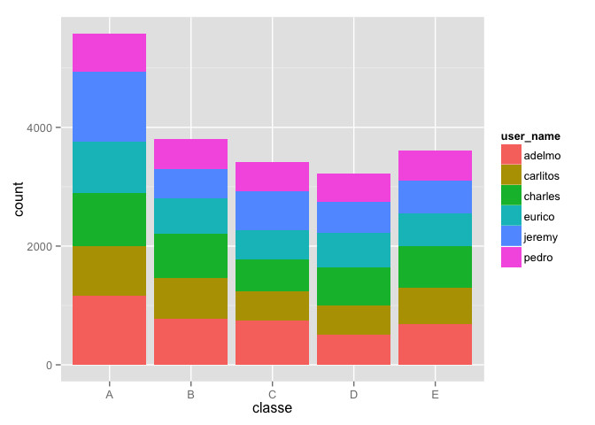
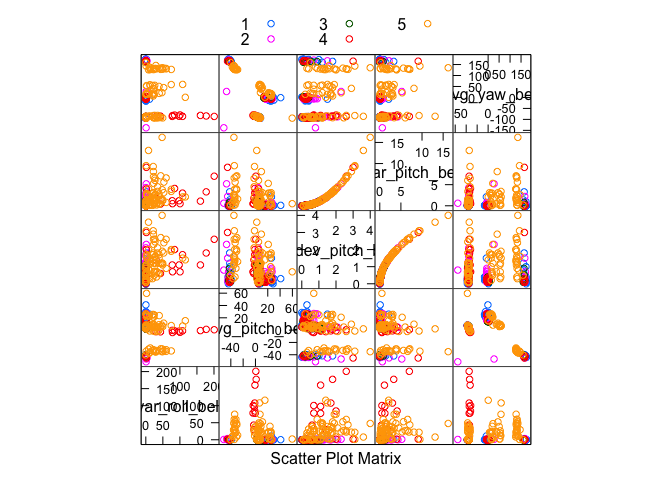
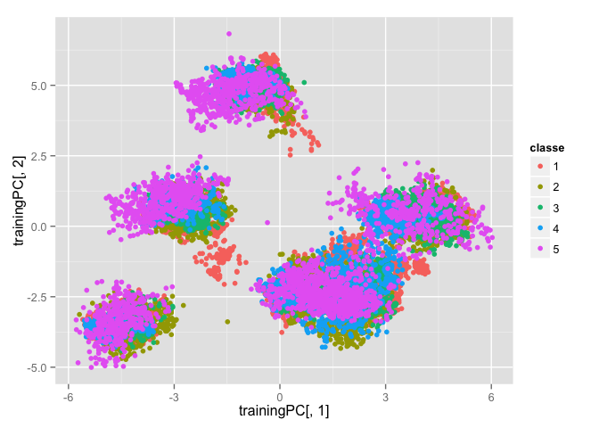
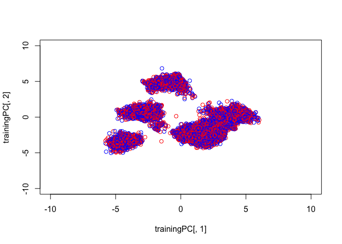
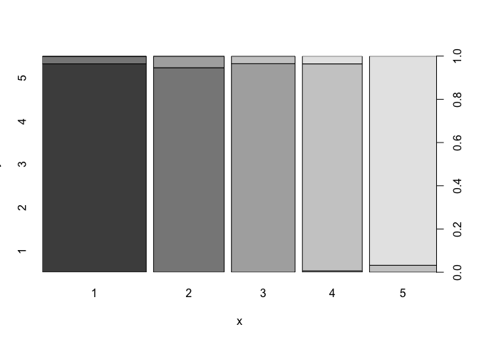

# Write-Up4
aaron gowins  
October 11, 2015  

# Writeup
### Load data, take a look...


```r
URL<-"https://d396qusza40orc.cloudfront.net/predmachlearn/pml-training.csv"
download.file(URL,destfile="TRAIN",method="curl")
trainer<-read.csv(file="TRAIN",header=TRUE,sep=",")
URL2<-"https://d396qusza40orc.cloudfront.net/predmachlearn/pml-testing.csv"
download.file(URL2,destfile="TEST",method="curl")
tester<-read.csv(file="TEST",header=TRUE,sep=",")
#head(trainer)
```


```r
ggplot(data=trainer,aes(x=classe,fill=user_name)) + geom_bar()
```

 

```r
trainer$classe<-as.numeric(trainer$classe)
trainer$classe<-as.factor(trainer$classe)
library(caret)
inTrain<-createDataPartition(y=trainer$classe,p=.75,list=FALSE)
training<-trainer[inTrain,]
testing<-trainer[-inTrain,]
library(car)


library(AppliedPredictiveModeling)
featurePlot(x=trainer[,30:34],y=trainer$classe,plot="pairs",auto.key = list(columns = 3))
```

 

```r
scatterplotMatrix(trainer[30:34])
```

 

```r
set.seed(111)


library(MASS)

trainer[is.na(trainer)]<-0
training[is.na(training)]<-0
testing[is.na(testing)]<-0
tester[is.na(tester)]<-0


x<-nearZeroVar(training)
trainer<-trainer[,-x]
training<-training[,-x]
testing<-testing[,-x]
tester<-tester[,-x]
M<-abs(cor(training[,c(-2,-5,-6,-59)]))
diag(M)<-0
     which(M>.9,arr.ind=T)
```

```
##                  row col
## total_accel_belt   7   4
## accel_belt_y      12   4
## accel_belt_z      13   4
## accel_belt_x      11   5
## roll_belt          4   7
## accel_belt_y      12   7
## accel_belt_z      13   7
## pitch_belt         5  11
## roll_belt          4  12
## total_accel_belt   7  12
## accel_belt_z      13  12
## roll_belt          4  13
## total_accel_belt   7  13
## accel_belt_y      12  13
## gyros_arm_y       22  21
## gyros_arm_x       21  22
```

```r
prepro<-preProcess(training[,c(-2,-5,-6,-59)],method="pca",pcaComp=3)
trainingPC<-predict(prepro,training[,c(-2,-5,-6,-59)])
colors <- c("blue", "grey", "green","red","black")

qplot(trainingPC[,1],trainingPC[,2],data=training,colour=classe)
```

 

```r
library(scatterplot3d)

colors <- colors[as.numeric(training$classe)]
scatterplot3d(x=training$classe,y=trainingPC[,1],z=trainingPC[,2], main="3D Scatterplot",
              pch=19,color=colors)
```

 

```r
modelFit<-train(training$classe ~ .,method="lda",data=trainingPC,trControl=trainControl(method="cv",number=5,repeats=3))
train.lda<-predict(modelFit,trainingPC)
confusionMatrix(training$classe,predict(modelFit,trainingPC))
```

```
## Confusion Matrix and Statistics
## 
##           Reference
## Prediction    1    2    3    4    5
##          1 3324  206    0    0  655
##          2 1474  280    0    0 1094
##          3 1851  181    0    0  535
##          4 1128  290    0    0  994
##          5 1156  230    0    0 1320
## 
## Overall Statistics
##                                           
##                Accuracy : 0.3346          
##                  95% CI : (0.3269, 0.3422)
##     No Information Rate : 0.6069          
##     P-Value [Acc > NIR] : 1               
##                                           
##                   Kappa : 0.1179          
##  Mcnemar's Test P-Value : NA              
## 
## Statistics by Class:
## 
##                      Class: 1 Class: 2 Class: 3 Class: 4 Class: 5
## Sensitivity            0.3721  0.23589       NA       NA  0.28708
## Specificity            0.8512  0.81021   0.8256   0.8361  0.86304
## Pos Pred Value         0.7943  0.09831       NA       NA  0.48780
## Neg Pred Value         0.4675  0.92359       NA       NA  0.72711
## Prevalence             0.6069  0.08065   0.0000   0.0000  0.31241
## Detection Rate         0.2258  0.01902   0.0000   0.0000  0.08969
## Detection Prevalence   0.2843  0.19350   0.1744   0.1639  0.18386
## Balanced Accuracy      0.6116  0.52305       NA       NA  0.57506
```

```r
#table(train.lda,training$classe)

testingPC<-predict(prepro,testing[,c(-2,-5,-6,-59)])
testy<-predict(modelFit,testingPC)

head(testingPC)
```

```
##         PC1      PC2      PC3
## 2  4.131503 1.110786 3.542503
## 12 4.123110 1.105787 3.511026
## 15 4.138758 1.093102 3.504836
## 16 4.090620 1.116830 3.510694
## 18 4.052018 1.151055 3.471380
## 26 4.125234 1.101708 3.520589
```

```r
confusionMatrix(testing$classe,predict(modelFit,testingPC))
```

```
## Confusion Matrix and Statistics
## 
##           Reference
## Prediction    1    2    3    4    5
##          1 1113   65    0    0  217
##          2  474  122    0    0  353
##          3  637   52    0    0  166
##          4  380   95    0    0  329
##          5  374   82    0    0  445
## 
## Overall Statistics
##                                           
##                Accuracy : 0.3426          
##                  95% CI : (0.3293, 0.3561)
##     No Information Rate : 0.6073          
##     P-Value [Acc > NIR] : 1               
##                                           
##                   Kappa : 0.1284          
##  Mcnemar's Test P-Value : NA              
## 
## Statistics by Class:
## 
##                      Class: 1 Class: 2 Class: 3 Class: 4 Class: 5
## Sensitivity            0.3737  0.29327       NA       NA  0.29470
## Specificity            0.8536  0.81573   0.8257   0.8361  0.86565
## Pos Pred Value         0.7978  0.12856       NA       NA  0.49390
## Neg Pred Value         0.4685  0.92566       NA       NA  0.73395
## Prevalence             0.6073  0.08483   0.0000   0.0000  0.30791
## Detection Rate         0.2270  0.02488   0.0000   0.0000  0.09074
## Detection Prevalence   0.2845  0.19352   0.1743   0.1639  0.18373
## Balanced Accuracy      0.6137  0.55450       NA       NA  0.58017
```

```r
table(testy, testing$classe)
```

```
##      
## testy    1    2    3    4    5
##     1 1113  474  637  380  374
##     2   65  122   52   95   82
##     3    0    0    0    0    0
##     4    0    0    0    0    0
##     5  217  353  166  329  445
```

```r
plot(testing$classe,testy)
```

 

```r
dim(tester)
```

```
## [1] 20 59
```

```r
testerPred<-predict(prepro,tester[,c(-2,-5,-6,-59)])
testerPre<-predict(modelFit,testerPred)
levels(testerPre)<-c("A","B","C","D","E")
testerPre
```

```
##  [1] A A A A A A A A A A A A E A A E A E A B
## Levels: A B C D E
```

