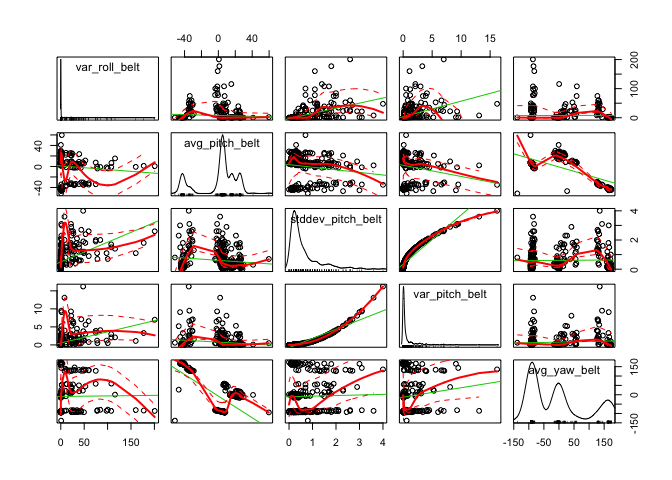
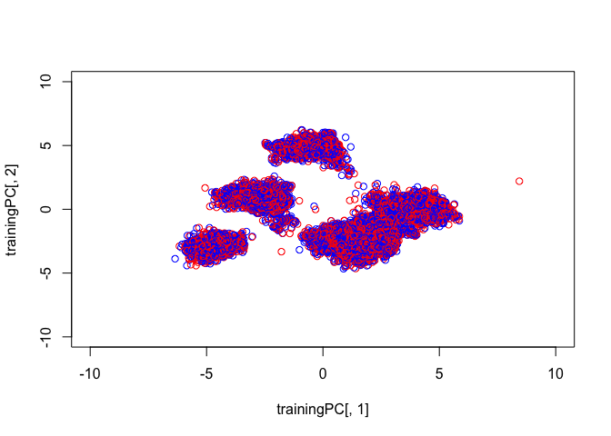

# Write-Up3
aaron gowins  
October 11, 2015  

# Writeup
### Load data, take a look...


```r
URL<-"https://d396qusza40orc.cloudfront.net/predmachlearn/pml-training.csv"
download.file(URL,destfile="TRAIN",method="curl")
trainer<-read.csv(file="TRAIN",header=TRUE,sep=",")
URL2<-"https://d396qusza40orc.cloudfront.net/predmachlearn/pml-testing.csv"
download.file(URL2,destfile="TEST",method="curl")
tester<-read.csv(file="TEST",header=TRUE,sep=",")
#head(trainer)
```


```r
trainer$classe<-as.numeric(trainer$classe)
trainer$classe<-as.factor(trainer$classe)
library(caret)
inTrain<-createDataPartition(y=trainer$classe,p=.75,list=FALSE)
training<-trainer[inTrain,]
testing<-trainer[-inTrain,]
library(car)
scatterplotMatrix(trainer[30:34])
```

 

```r
library(MASS)
#head(tester)

#training$classe<-as.numeric(training$classe)
#training$classe<-as.factor(training$classe)
#training[training==""]<-0
training[is.na(training)]<-0
testing[is.na(testing)]<-0

#is.data.frame(training)
#dim(training)
x<-nearZeroVar(training)
training<-training[,-x]
testing<-testing[,-x]
M<-abs(cor(training[,c(-2,-5,-6,-59)]))
diag(M)<-0
     which(M>.9,arr.ind=T)
```

```
##                  row col
## total_accel_belt   7   4
## accel_belt_y      12   4
## accel_belt_z      13   4
## accel_belt_x      11   5
## roll_belt          4   7
## accel_belt_y      12   7
## accel_belt_z      13   7
## pitch_belt         5  11
## roll_belt          4  12
## total_accel_belt   7  12
## accel_belt_z      13  12
## roll_belt          4  13
## total_accel_belt   7  13
## accel_belt_y      12  13
## gyros_arm_y       22  21
## gyros_arm_x       21  22
## gyros_dumbbell_z  36  34
## gyros_forearm_z   49  34
## gyros_dumbbell_x  34  36
## gyros_forearm_z   49  36
## gyros_dumbbell_x  34  49
## gyros_dumbbell_z  36  49
```

```r
#preproc<-preProcess(training[,c(-2,-5,-6,-59)],method=c("center","scale"))
#training<-predict(preproc,training[,c(-2,-5,-6,-59)])$classe
#dim(training)
#head(training)


#training<-training[,c(-2,-5,-6)]
#testing<-testing[,c(-2,-5,-6)]
#training[training==""]<-0
prepro<-preProcess(training[,c(-2,-5,-6,-59)],method="pca",pcaComp=25)
trainingPC<-predict(prepro,training[,c(-2,-5,-6,-59)])

plot(trainingPC[,1],trainingPC[,2],xlim=c(-10, 10),ylim=c(-10,10),col=c("red","blue"))
```

 

```r
#training$classe<-as.numeric(training$classe)
#training[sapply(training,is.numeric)]
#training$classe<-as.factor(training$classe)
#dim(training)
#prepro<-preProcess(training[,c(-59)],method=c("center","scale"))
#training<-predict(prepro,training[,c(-2,-5,-59)])$classe
#m<-x[x[,"zeroVar"] + x[,"nzv"] > 0, ] 
#typeof(m)
#ls(training)
#rm(training[m])
#head(training)


modelFit<-train(training$classe ~ .,method="lda",data=trainingPC)
train.lda<-predict(modelFit,trainingPC)
confusionMatrix(training$classe,predict(modelFit,trainingPC))
```

```
## Confusion Matrix and Statistics
## 
##           Reference
## Prediction    1    2    3    4    5
##          1 4031  154    0    0    0
##          2   43 2658  147    0    0
##          3    0  116 2376   75    0
##          4    0    0   43 2215  154
##          5    0    0    0  237 2469
## 
## Overall Statistics
##                                         
##                Accuracy : 0.9342        
##                  95% CI : (0.93, 0.9381)
##     No Information Rate : 0.2768        
##     P-Value [Acc > NIR] : < 2.2e-16     
##                                         
##                   Kappa : 0.9168        
##  Mcnemar's Test P-Value : NA            
## 
## Statistics by Class:
## 
##                      Class: 1 Class: 2 Class: 3 Class: 4 Class: 5
## Sensitivity            0.9894   0.9078   0.9260   0.8765   0.9413
## Specificity            0.9855   0.9839   0.9843   0.9838   0.9804
## Pos Pred Value         0.9632   0.9333   0.9256   0.9183   0.9124
## Neg Pred Value         0.9959   0.9773   0.9844   0.9746   0.9872
## Prevalence             0.2768   0.1989   0.1743   0.1717   0.1782
## Detection Rate         0.2739   0.1806   0.1614   0.1505   0.1678
## Detection Prevalence   0.2843   0.1935   0.1744   0.1639   0.1839
## Balanced Accuracy      0.9875   0.9458   0.9551   0.9302   0.9608
```

```r
#ldahist(data = train.lda[,1], g=Type)
#table(predict(modelFit)$class)
#table(predict(modelFit, type="class")$class, training$classe)
table(train.lda,training$classe)
```

```
##          
## train.lda    1    2    3    4    5
##         1 4031   43    0    0    0
##         2  154 2658  116    0    0
##         3    0  147 2376   43    0
##         4    0    0   75 2215  237
##         5    0    0    0  154 2469
```

```r
testingPC<-predict(prepro,testing[,c(-2,-5,-6,-59)])
testy<-predict(modelFit,testingPC)
#dim(testing)
#dim(testingPC)
head(testingPC)
```

```
##         PC1       PC2      PC3        PC4       PC5      PC6        PC7
## 2  4.215880 0.8224966 3.678472 -0.8900502 -1.305889 2.158114 -0.7639633
## 7  4.184560 0.8178795 3.649893 -0.8879669 -1.232741 2.123376 -0.7718071
## 10 4.244829 0.8720892 3.676108 -0.8928033 -1.321002 2.189119 -0.7755452
## 12 4.206185 0.8161357 3.650378 -0.8844207 -1.215891 2.109929 -0.7587361
## 14 4.182751 0.7860882 3.656163 -0.8812194 -1.245037 2.135004 -0.7546146
## 15 4.220263 0.8031683 3.643855 -0.8835507 -1.213829 2.097438 -0.7431013
##         PC8       PC9      PC10      PC11        PC12        PC13
## 2  2.599773 0.1938600 0.3382156 0.8670235 -0.18431800  0.25722227
## 7  2.624308 0.1829741 0.3343897 0.7440214 -0.14034255 -0.03345235
## 10 2.578067 0.1849955 0.3482190 0.7420934 -0.08847503 -0.03622720
## 12 2.622278 0.2091700 0.2928091 0.7828808 -0.18285370  0.10125823
## 14 2.627374 0.2294739 0.3355983 0.8026258 -0.20650180  0.13645289
## 15 2.633621 0.2387127 0.3180231 0.8133991 -0.18324897  0.19892636
##          PC14     PC15      PC16       PC17      PC18      PC19       PC20
## 2   0.2411351 3.168422 0.9322948 -0.4992170 -1.129647 0.1899645 -0.5258087
## 7  -1.2060111 2.840106 0.7449116 -0.5156677 -1.248451 0.2670770 -0.5652822
## 10 -0.7811204 2.902487 0.7459034 -0.5077102 -1.204377 0.1787806 -0.5449053
## 12 -0.6939850 2.979732 0.8170033 -0.5014199 -1.228135 0.2772303 -0.5638195
## 14 -0.5433825 3.022016 0.8461501 -0.4890199 -1.199545 0.2650658 -0.5686970
## 15 -0.4529082 3.051481 0.8077490 -0.4663758 -1.233797 0.2622413 -0.5862953
##         PC21      PC22       PC23        PC24      PC25
## 2  -1.230392 0.7367957 -0.3064255 -0.09262936 0.4267092
## 7  -1.248242 0.7584091 -0.3602543 -0.10633492 0.4624866
## 10 -1.256805 0.7276628 -0.3667841 -0.08631784 0.4015828
## 12 -1.246694 0.7348052 -0.3403090 -0.12276590 0.4520388
## 14 -1.214143 0.7616162 -0.3632824 -0.11142224 0.4283984
## 15 -1.226562 0.7276857 -0.4051113 -0.10007369 0.4455267
```

```r
#ldaPred<-predict(modelFit,testing)
confusionMatrix(testing$classe,predict(modelFit,testingPC))
```

```
## Confusion Matrix and Statistics
## 
##           Reference
## Prediction    1    2    3    4    5
##          1 1345   50    0    0    0
##          2   13  889   47    0    0
##          3    0   38  789   28    0
##          4    0    0   16  733   55
##          5    0    0    0   83  818
## 
## Overall Statistics
##                                           
##                Accuracy : 0.9327          
##                  95% CI : (0.9253, 0.9396)
##     No Information Rate : 0.2769          
##     P-Value [Acc > NIR] : < 2.2e-16       
##                                           
##                   Kappa : 0.915           
##  Mcnemar's Test P-Value : NA              
## 
## Statistics by Class:
## 
##                      Class: 1 Class: 2 Class: 3 Class: 4 Class: 5
## Sensitivity            0.9904   0.9099   0.9261   0.8685   0.9370
## Specificity            0.9859   0.9847   0.9837   0.9825   0.9794
## Pos Pred Value         0.9642   0.9368   0.9228   0.9117   0.9079
## Neg Pred Value         0.9963   0.9777   0.9844   0.9729   0.9863
## Prevalence             0.2769   0.1992   0.1737   0.1721   0.1780
## Detection Rate         0.2743   0.1813   0.1609   0.1495   0.1668
## Detection Prevalence   0.2845   0.1935   0.1743   0.1639   0.1837
## Balanced Accuracy      0.9882   0.9473   0.9549   0.9255   0.9582
```

```r
#typeof(ldaPred)
#typeof(modelFit)
table(testy, testing$classe)
```

```
##      
## testy    1    2    3    4    5
##     1 1345   13    0    0    0
##     2   50  889   38    0    0
##     3    0   47  789   16    0
##     4    0    0   28  733   83
##     5    0    0    0   55  818
```

```r
#ct <- table(training$classe, modelFit$class)
#diag(prop.table(ct, 1))
# total percent correct
#sum(diag(prop.table(ct)))
#tester<-tester[,-x]
#dim(tester)
#dim(testing)
#trainer[is.na(trainer)]<-0
#testPred<-predict(object=modelFit,newdata=tester)
#tester$classe<-0
#head(tester)
#typeof(testPred)
#typeof(modelFit)
#table(testPred$class, tester$classe)
```

