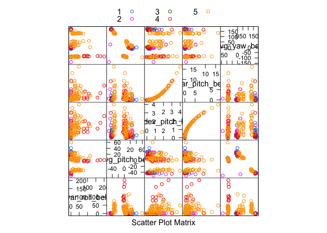
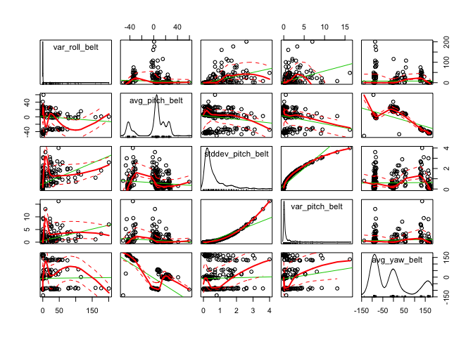
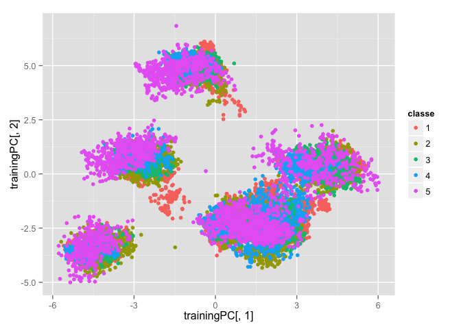
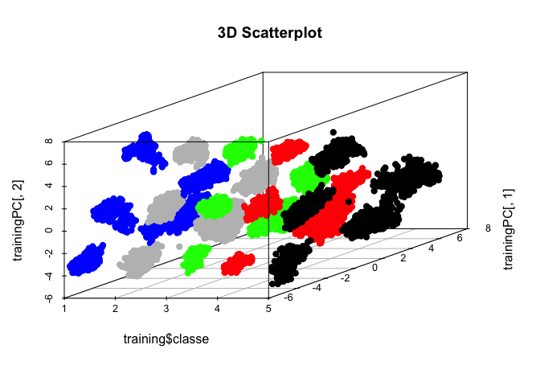
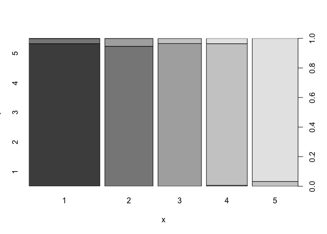

# Write-Up4
aaron gowins  
October 11, 2015  

# Writeup
### Load data, take a look...


```r
URL<-"https://d396qusza40orc.cloudfront.net/predmachlearn/pml-training.csv"
download.file(URL,destfile="TRAIN",method="curl")
trainer<-read.csv(file="TRAIN",header=TRUE,sep=",")
URL2<-"https://d396qusza40orc.cloudfront.net/predmachlearn/pml-testing.csv"
download.file(URL2,destfile="TEST",method="curl")
tester<-read.csv(file="TEST",header=TRUE,sep=",")
#head(trainer)
```


```r
ggplot(data=trainer,aes(x=classe,fill=user_name)) + geom_bar()
```

 

```r
trainer$classe<-as.numeric(trainer$classe)
trainer$classe<-as.factor(trainer$classe)
library(caret)
inTrain<-createDataPartition(y=trainer$classe,p=.75,list=FALSE)
training<-trainer[inTrain,]
testing<-trainer[-inTrain,]
library(car)


library(AppliedPredictiveModeling)
featurePlot(x=trainer[,30:34],y=trainer$classe,plot="pairs",auto.key = list(columns = 3))
```

 

```r
scatterplotMatrix(trainer[30:34])
```

 

```r
set.seed(111)


library(MASS)

trainer[is.na(trainer)]<-0
training[is.na(training)]<-0
testing[is.na(testing)]<-0
tester[is.na(tester)]<-0


x<-nearZeroVar(training)
trainer<-trainer[,-x]
training<-training[,-x]
testing<-testing[,-x]
tester<-tester[,-x]
M<-abs(cor(training[,c(-2,-5,-6,-59)]))
diag(M)<-0
     which(M>.9,arr.ind=T)
```

```
##                  row col
## total_accel_belt   7   4
## accel_belt_y      12   4
## accel_belt_z      13   4
## accel_belt_x      11   5
## roll_belt          4   7
## accel_belt_y      12   7
## accel_belt_z      13   7
## pitch_belt         5  11
## roll_belt          4  12
## total_accel_belt   7  12
## accel_belt_z      13  12
## roll_belt          4  13
## total_accel_belt   7  13
## accel_belt_y      12  13
## gyros_arm_y       22  21
## gyros_arm_x       21  22
```

```r
prepro<-preProcess(training[,c(-2,-5,-6,-59)],method="pca",pcaComp=31)
trainingPC<-predict(prepro,training[,c(-2,-5,-6,-59)])
colors <- c("blue", "grey", "green","red","black")

qplot(trainingPC[,1],trainingPC[,2],data=training,colour=classe)
```

 

```r
library(scatterplot3d)

colors <- colors[as.numeric(training$classe)]
scatterplot3d(x=training$classe,y=trainingPC[,1],z=trainingPC[,2], main="3D Scatterplot",
              pch=19,color=colors)
```

 

```r
modelFit<-train(training$classe ~ .,method="lda",data=trainingPC,trControl=trainControl(method="cv",number=5,repeats=3))
train.lda<-predict(modelFit,trainingPC)
confusionMatrix(training$classe,predict(modelFit,trainingPC))
```

```
## Confusion Matrix and Statistics
## 
##           Reference
## Prediction    1    2    3    4    5
##          1 4048  137    0    0    0
##          2    0 2703  145    0    0
##          3    0    1 2463  103    0
##          4    0    0   14 2306   92
##          5    0    0    0  113 2593
## 
## Overall Statistics
##                                          
##                Accuracy : 0.9589         
##                  95% CI : (0.9556, 0.962)
##     No Information Rate : 0.275          
##     P-Value [Acc > NIR] : < 2.2e-16      
##                                          
##                   Kappa : 0.9481         
##  Mcnemar's Test P-Value : NA             
## 
## Statistics by Class:
## 
##                      Class: 1 Class: 2 Class: 3 Class: 4 Class: 5
## Sensitivity            1.0000   0.9514   0.9394   0.9144   0.9657
## Specificity            0.9872   0.9878   0.9914   0.9913   0.9906
## Pos Pred Value         0.9673   0.9491   0.9595   0.9561   0.9582
## Neg Pred Value         1.0000   0.9884   0.9869   0.9824   0.9923
## Prevalence             0.2750   0.1930   0.1781   0.1714   0.1824
## Detection Rate         0.2750   0.1837   0.1673   0.1567   0.1762
## Detection Prevalence   0.2843   0.1935   0.1744   0.1639   0.1839
## Balanced Accuracy      0.9936   0.9696   0.9654   0.9528   0.9782
```

```r
#table(train.lda,training$classe)

testingPC<-predict(prepro,testing[,c(-2,-5,-6,-59)])
testy<-predict(modelFit,testingPC)

head(testingPC)
```

```
##         PC1      PC2      PC3       PC4       PC5       PC6       PC7
## 2  4.131503 1.110786 3.542503 0.9764827 -2.652488 0.7028580 -2.535466
## 12 4.123110 1.105787 3.511026 0.8984576 -2.601640 0.6909681 -2.542974
## 15 4.138758 1.093102 3.504836 0.8963399 -2.585405 0.6794168 -2.558113
## 16 4.090620 1.116830 3.510694 0.8953064 -2.572333 0.6841874 -2.564597
## 18 4.052018 1.151055 3.471380 0.8846701 -2.583539 0.6813233 -2.584100
## 26 4.125234 1.101708 3.520589 0.9321762 -2.664244 0.6834717 -2.508095
##          PC8          PC9      PC10      PC11       PC12       PC13
## 2  0.1792022 -0.039216661 0.7411091 0.4336603 -0.7783452 -0.5856726
## 12 0.1673567 -0.013123296 0.7531903 0.4867598 -0.6896714 -0.5730020
## 15 0.1779397  0.013320518 0.7616241 0.4698115 -0.7221122 -0.5844885
## 16 0.1973767  0.008284524 0.7720865 0.4826312 -0.7244979 -0.5783007
## 18 0.1030497  0.011459678 0.7644830 0.3939765 -0.7266396 -0.5076812
## 26 0.1882725 -0.003166480 0.7807730 0.3640723 -0.5363381 -0.5571725
##           PC14        PC15      PC16     PC17       PC18       PC19
## 2  -0.07796215 -0.24631907 -3.069670 1.352679 -0.6270574 -0.1171618
## 12  0.18104056  0.65755407 -2.819105 1.406578 -0.6579178 -0.1279254
## 15  0.05565858  0.44065940 -2.907026 1.353536 -0.6898093 -0.1468302
## 16 -0.02772372  0.33285243 -2.946695 1.361726 -0.7258372 -0.1372756
## 18 -0.15106926  0.06506459 -3.030258 1.244445 -0.7222113 -0.2077503
## 26  0.72213798  2.12445529 -2.372850 1.415724 -0.6336717 -0.1663198
##        PC20      PC21      PC22      PC23        PC24       PC25
## 2  1.690574 0.2631143 0.9505400 0.1484003 -0.08284765 -0.1430754
## 12 1.766103 0.2063787 0.9533122 0.1334682 -0.09614020 -0.1897586
## 15 1.773488 0.2182838 0.9394389 0.1261597 -0.12842108 -0.1721683
## 16 1.757008 0.1929239 0.9360773 0.1023673 -0.16233261 -0.1592468
## 18 1.712302 0.2207403 0.9278991 0.1525878 -0.09658955 -0.1530817
## 26 1.788090 0.2403432 0.9724644 0.1679527 -0.12783400 -0.1614580
##            PC26      PC27       PC28      PC29      PC30      PC31
## 2  -0.103142074 0.3315411 -0.4573555 0.3593918 0.5426345 0.9030581
## 12 -0.066888327 0.3702844 -0.4440578 0.3892924 0.5506354 0.8769816
## 15 -0.009373006 0.3794642 -0.4194554 0.3837350 0.5694278 0.9145292
## 16 -0.031824607 0.3788465 -0.4100282 0.4423922 0.6169317 0.9218807
## 18 -0.052280751 0.3519384 -0.4107110 0.2921470 0.5554433 0.9134806
## 26 -0.061654634 0.3664087 -0.4513140 0.3793312 0.5875307 0.9149512
```

```r
confusionMatrix(testing$classe,predict(modelFit,testingPC))
```

```
## Confusion Matrix and Statistics
## 
##           Reference
## Prediction    1    2    3    4    5
##          1 1345   49    0    0    1
##          2    0  898   51    0    0
##          3    0    0  825   30    0
##          4    0    0    5  770   29
##          5    0    0    0   29  872
## 
## Overall Statistics
##                                           
##                Accuracy : 0.9604          
##                  95% CI : (0.9546, 0.9657)
##     No Information Rate : 0.2743          
##     P-Value [Acc > NIR] : < 2.2e-16       
##                                           
##                   Kappa : 0.95            
##  Mcnemar's Test P-Value : NA              
## 
## Statistics by Class:
## 
##                      Class: 1 Class: 2 Class: 3 Class: 4 Class: 5
## Sensitivity            1.0000   0.9483   0.9364   0.9288   0.9667
## Specificity            0.9860   0.9871   0.9925   0.9917   0.9928
## Pos Pred Value         0.9642   0.9463   0.9649   0.9577   0.9678
## Neg Pred Value         1.0000   0.9876   0.9862   0.9856   0.9925
## Prevalence             0.2743   0.1931   0.1796   0.1690   0.1839
## Detection Rate         0.2743   0.1831   0.1682   0.1570   0.1778
## Detection Prevalence   0.2845   0.1935   0.1743   0.1639   0.1837
## Balanced Accuracy      0.9930   0.9677   0.9645   0.9602   0.9797
```

```r
table(testy, testing$classe)
```

```
##      
## testy    1    2    3    4    5
##     1 1345    0    0    0    0
##     2   49  898    0    0    0
##     3    0   51  825    5    0
##     4    0    0   30  770   29
##     5    1    0    0   29  872
```

```r
plot(testing$classe,testy)
```

 

```r
dim(tester)
```

```
## [1] 20 59
```

```r
testerPred<-predict(prepro,tester[,c(-2,-5,-6,-59)])
testerPre<-predict(modelFit,testerPred)
levels(testerPre)<-c("A","B","C","D","E")
testerPre
```

```
##  [1] A A A A A A A A A A A A A A A A A A A A
## Levels: A B C D E
```

